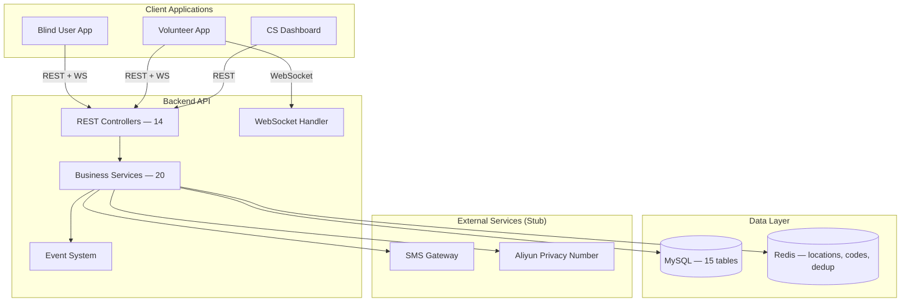
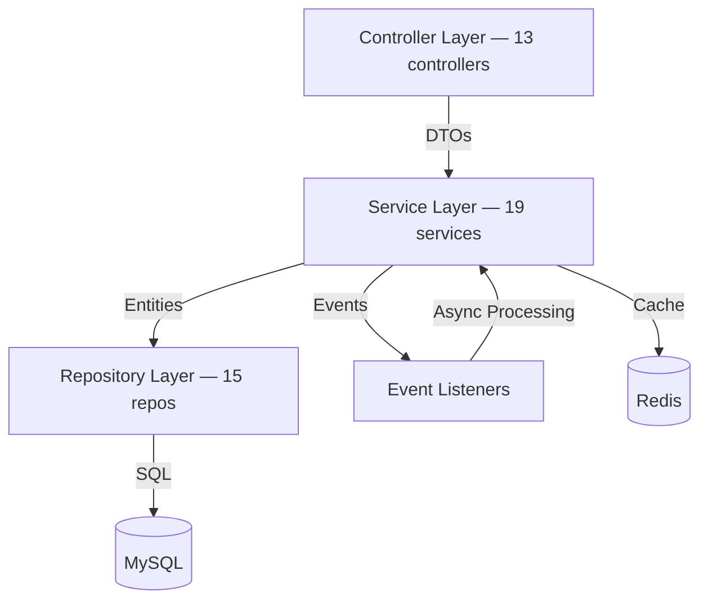
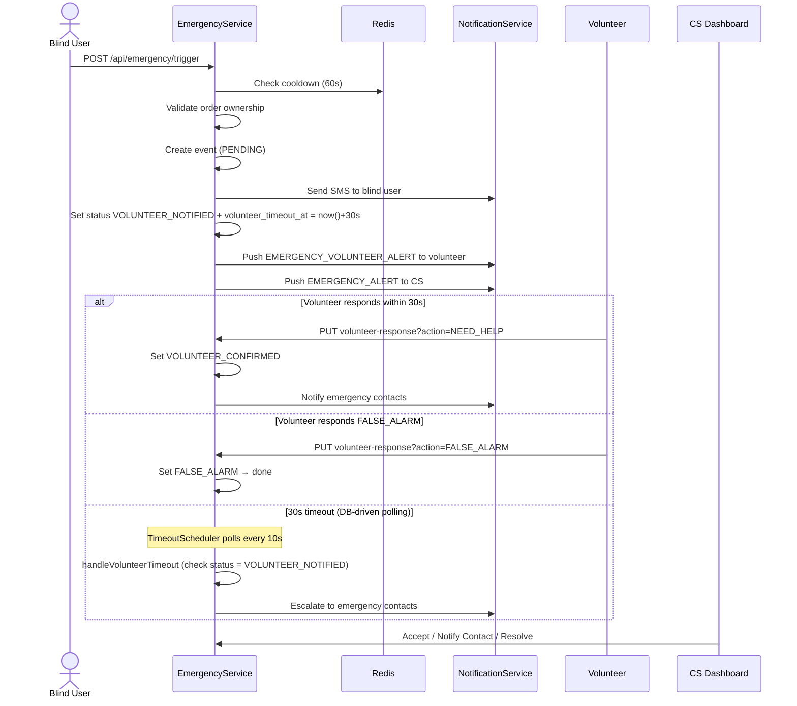
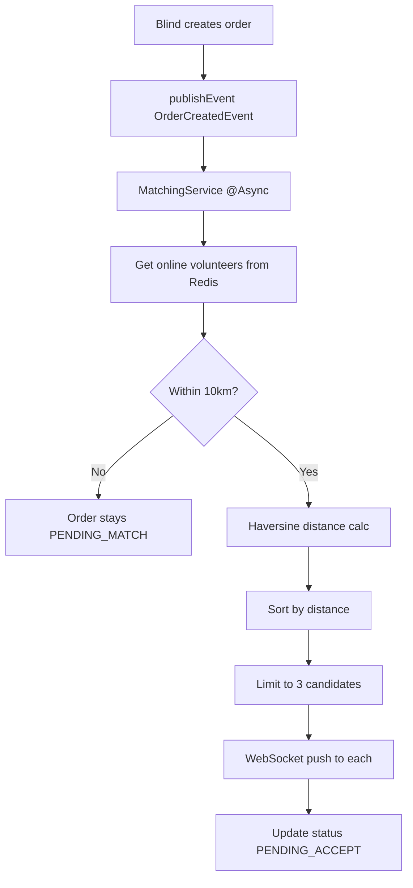
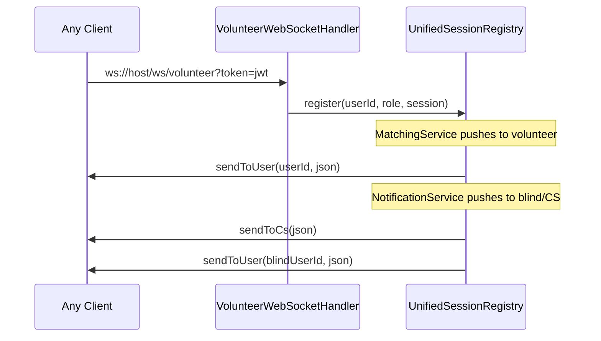

# Blind Running Companion (助盲跑) Backend - Architecture Guide

## Executive Summary

The **Blind Running Companion** connects visually impaired runners with volunteer companions. The system provides real-time matching, order lifecycle management, emergency response, proximity detection, and privacy number call services.

### Key Features
- **SMS-based Authentication**: Phone number verification with time-limited codes
- **Real-time Matching**: Geolocation-based volunteer selection using Redis caching
- **Order Lifecycle Management**: State machine-driven order processing (7 states)
- **Emergency Response**: Volunteer confirmation flow with 30s timeout, CS escalation
- **Proximity Detection**: Real-time distance alerts between blind users and volunteers
- **WebSocket Notifications**: Multi-role live push (blind + volunteer + CS)
- **Emergency Contacts**: Independent CRUD, 1-5 per user with primary designation
- **Privacy Number Calls**: Mock implementation returning CONNECTED with virtual number
- **Review System**: Post-service rating and feedback

### Technology Stack
- **Framework**: Spring Boot 3.4.4, Java 17
- **Database**: MySQL with JPA/Hibernate ORM (ddl-auto=update)
- **Caching**: Redis for locations, verification codes, proximity dedup
- **Authentication**: JWT (JSON Web Tokens) with custom filter chain
- **Real-time Communication**: WebSocket (native, UnifiedSessionRegistry)
- **Build Tool**: Gradle
- **Testing**: 110 tests (107 regular + 3 slow), Testcontainers for Redis

---

## System Overview



---

## Architecture Layers



### Controller Layer (`controller/`)

| Controller | Path | Purpose |
|------------|------|---------|
| AuthController | `/api/auth/**` | SMS login, JWT |
| RoleController | `/api/user/role` | One-time role selection |
| BlindController | `/api/blind/**` | Blind profile |
| BlindLocationController | `/api/blind/location` | Blind location reporting |
| EmergencyContactController | `/api/users/{id}/emergency-contacts` | Emergency contact CRUD |
| VolunteerController | `/api/volunteer/**` | Profile, verification, location |
| OrderController | `/api/orders/**` | Order CRUD + accept/reject/finish/cancel |
| OrderStatusController | `/api/orders/{id}/en-route\|arrived\|status-logs` | Status transitions + logs |
| EmergencyController | `/api/emergency/**` | Trigger + volunteer response |
| CsController | `/api/cs/**` | CS emergency operations |
| CsAuthController | `/api/cs/auth/**` | CS username/password login |
| CallController | `/api/orders/{id}/call/**` | Call initiate + records |
| ReviewController | `/api/orders/{id}/review` | Reviews |
| UserController | `/api/users/{id}` | User info + soft delete |

### Service Layer (`service/`)

| Service | Purpose |
|---------|---------|
| AuthService | Authentication flow |
| CSAuthService | CS login (BCrypt + JWT with csRole) |
| UserService | User management, soft delete |
| BlindService | Blind profile CRUD |
| BlindLocationService | Blind location Redis caching |
| EmergencyContactService | Emergency contact CRUD (1-5 per user) |
| VolunteerService | Volunteer profile + verification |
| VolunteerLocationService | Dual-write Redis+MySQL location |
| OrderService | Order lifecycle (8 constructor params) |
| OrderStatusLogService | Logs every status change |
| MatchingService | Geolocation-based volunteer selection |
| EmergencyService | Emergency trigger + volunteer timeout flow |
| NotificationService | WebSocket push + SMS stub |
| ProximityService | 100m proximity detection |
| PrivateNumberService | Mock impl (CONNECTED + virtual number) |
| ReviewService | Review management |
| SmsService / MockSmsServiceImpl | SMS interface + mock impl |
| VerificationCodeService | Redis-based code generation |
| FileStorageService / LocalFileStorageService | File upload |

### Repository Layer (`repository/`) — 15 repositories

UserRepository, BlindProfileRepository, VolunteerProfileRepository, VolunteerLocationRepository, VolunteerAvailableTimeRepository, RunOrderRepository, OrderReviewRepository, OrderStatusLogRepository, EmergencyContactRepository, EmergencyEventRepository, EmergencyNotificationRepository, NotificationLogRepository, NotificationTemplateRepository, CallRecordRepository, CSUserRepository

---

## Data Model

### Entity Relationship Diagram

```mermaid
erDiagram
    User ||--o| BlindProfile : "1:1 @MapsId"
    User ||--o| VolunteerProfile : "1:1 @MapsId"
    User ||--o{ RunOrder : "creates (BLIND)"
    User ||--o{ RunOrder : "accepts (VOLUNTEER)"
    User ||--o{ VolunteerLocation : "reports"
    User ||--o{ VolunteerAvailableTime : "has"
    User ||--o{ OrderReview : "writes"
    User ||--o{ EmergencyContact : "has 1-5"
    RunOrder ||--o| OrderReview : "has"
    RunOrder ||--o{ OrderStatusLog : "logs"
    RunOrder ||--o{ EmergencyEvent : "triggers"
    RunOrder ||--o{ CallRecord : "initiates"
    EmergencyEvent ||--o{ EmergencyNotification : "sends"
    EmergencyContact ||--o{ EmergencyNotification : "receives"
    CSUser ||--o{ EmergencyEvent : "handles"

    User {
        Long id PK
        String phone UK
        UserRole role
        LocalDateTime deletedAt
        LocalDateTime createdAt
    }

    BlindProfile {
        Long userId PK_FK
        String name
        String runningPace
        String specialNeeds
    }

    VolunteerProfile {
        Long userId PK_FK
        String name
        Boolean verified
        VerificationStatus verificationStatus
        String verificationDocUrl
    }

    RunOrder {
        Long id PK
        Long blindUserId FK
        Long volunteerId FK
        Double startLatitude
        Double startLongitude
        String startAddress
        OrderStatus status
        CancelledBy cancelledBy
        Long version
    }

    EmergencyContact {
        Long id PK
        Long userId FK
        String name
        String phone
        String relationship
        Boolean isPrimary
    }

    EmergencyEvent {
        Long id PK
        Long orderId FK
        Long userId FK
        TriggerType triggerType
        EmergencyStatus status
        BigDecimal gpsLat
        BigDecimal gpsLng
        VolunteerAction volunteerAction
        Long csUserId FK
    }

    OrderStatusLog {
        Long id PK
        Long orderId FK
        String fromStatus
        String toStatus
        String remark
    }

    CallRecord {
        Long id PK
        Long orderId FK
        String callerRole
        String calleeRole
        CallStatus status
    }

    CSUser {
        Long id PK
        String username UK
        String department
        CSRole role
    }
```

---

## Order Lifecycle

### State Machine

```mermaid
stateDiagram-v2
    [*] --> PENDING_MATCH: Blind creates order

    PENDING_MATCH --> PENDING_ACCEPT: System matches volunteers
    PENDING_MATCH --> IN_PROGRESS: Volunteer accepts directly
    PENDING_MATCH --> CANCELLED: Blind cancels

    PENDING_ACCEPT --> IN_PROGRESS: Volunteer accepts
    PENDING_ACCEPT --> CANCELLED: Blind cancels
    PENDING_ACCEPT --> REMATCHING: Volunteer cancels

    IN_PROGRESS --> DRIVER_EN_ROUTE: Volunteer en route
    IN_PROGRESS --> COMPLETED: Finish / Timeout
    IN_PROGRESS --> CANCELLED: Volunteer cancel (no-show)

    DRIVER_EN_ROUTE --> DRIVER_ARRIVED: Volunteer arrives
    DRIVER_EN_ROUTE --> COMPLETED: Finish
    DRIVER_EN_ROUTE --> REMATCHING: Volunteer cancels

    DRIVER_ARRIVED --> COMPLETED: Finish
    DRIVER_ARRIVED --> REMATCHING: Volunteer cancels

    REMATCHING --> IN_PROGRESS: New volunteer accepts
    REMATCHING --> CANCELLED: Blind cancels

    COMPLETED --> [*]
    CANCELLED --> [*]
```



### State Transition Rules

| From | To | Trigger | Who |
|------|----|---------|-----|
| PENDING_MATCH | PENDING_ACCEPT | Matching success | System |
| PENDING_MATCH | IN_PROGRESS | Direct accept | Volunteer |
| PENDING_MATCH | CANCELLED | Cancel | Blind |
| PENDING_ACCEPT | IN_PROGRESS | Accept | Volunteer |
| PENDING_ACCEPT | REMATCHING | Cancel | Volunteer |
| IN_PROGRESS | DRIVER_EN_ROUTE | En route | Volunteer |
| DRIVER_EN_ROUTE | DRIVER_ARRIVED | Arrived | Volunteer |
| DRIVER_EN_ROUTE | REMATCHING | Cancel | Volunteer |
| DRIVER_ARRIVED | REMATCHING | Cancel | Volunteer |
| REMATCHING | IN_PROGRESS | Accept | New volunteer |
| REMATCHING | CANCELLED | Cancel | Blind |
| IN_PROGRESS/EN_ROUTE/ARRIVED | COMPLETED | Finish | Volunteer |
| IN_PROGRESS | CANCELLED | Cancel (no-show) | Volunteer |

Every status change is logged by `OrderStatusLogService` and triggers `NotificationService.sendOrderStatusChange()`.

---

## Emergency Response System

### Flow



### Key Design Decisions
- **DB-driven polling** via `TimeoutScheduler` (replaces ScheduledExecutorService)
- **DB timeout fields** (`volunteer_timeout_at`, `rematch_notify_at`, `match_notify_at`) replace Redis keys
- **Cooldown** via `emergency:cooldown:{userId}` (60s, still Redis)
- **CSUser** in independent `cs_users` table (not `users` table)

---

## Real-time Matching System

### Matching Algorithm



### Redis Keys

| Key Pattern | TTL | Purpose |
|-------------|-----|---------|
| `vol:loc:{userId}` | 30s | Volunteer location |
| `blind:loc:{userId}` | 30s | Blind user location |
| `sms:code:{phone}` | 300s | Verification code |
| `emergency:cooldown:{userId}` | 60s | Emergency trigger cooldown |
| `proximity:notified:{orderId}` | — | Proximity alert dedup |

---

## WebSocket Communication

### Unified Session Registry

Supports blind, volunteer, and CS sessions in a single registry:



### Message Routing

| Method | Target | Use Case |
|--------|--------|----------|
| `sendToUser(userId, json)` | Specific user | Order push, emergency alert |
| `sendToCs(json)` | All CS sessions | Emergency escalation |
| `sendToUser(blindUserId, json)` | Blind user | Status change, proximity alert |

---

## Proximity Detection

### ProximityService

When both blind and volunteer locations are available, checks if distance < `app.proximity.threshold-meters` (default: 100m). Uses Redis `proximity:notified:{orderId}` to prevent duplicate alerts.

**Flow:**
1. Blind reports location → `BlindLocationService` updates Redis `blind:loc:{userId}`
2. For active orders, `ProximityService` calculates distance to volunteer
3. If < 100m and not yet notified → WebSocket push to both blind and volunteer
4. Set Redis dedup key to prevent repeated alerts

---

## Scheduled Tasks

### Order Timeout Auto-Completion

**Scheduler:** `OrderTimeoutScheduler.autoCompleteTimedOutOrders()`
**Trigger:** Every 60 seconds
**Purpose:** Complete orders exceeding `plannedEndTime`

### TimeoutScheduler (DB-driven polling)

All timeout detection uses database fields instead of Redis keys or ScheduledExecutorService.

| Method | Interval | Condition | Purpose |
|--------|----------|-----------|---------|
| `checkEmergencyTimeout` | 10s | `status=VOLUNTEER_NOTIFIED AND volunteer_timeout_at < NOW()` | Escalate if volunteer doesn't respond |
| `checkRematchTimeout` | 10s | `status=REMATCHING AND rematch_notify_at < NOW()` | Remind blind user, renew timer |
| `checkMatchTimeout` | 10s | `status=PENDING_MATCH AND match_notify_at < NOW()` | Remind blind user "no volunteer yet" |
| `checkOverdueOrders` | 60s | `status=IN_PROGRESS AND planned_end_time < NOW()-1h AND overdue_notified=false` | Alert volunteer about overdue order |

---

## Error Handling

### Exception Hierarchy

| Exception | HTTP Status | Use Case |
|-----------|-------------|----------|
| `AuthException` | 400 | Invalid code |
| `OrderNotFoundException` | 404 | Order not found |
| `OrderPermissionException` | 403 | Wrong user |
| `DuplicateOrderException` | 409 | Active order exists |
| `OrderStatusException` | 409 | Invalid transition |
| `RoleAlreadySetException` | 409 | Role already set |
| `OptimisticLockingFailureException` | 409 | Concurrent accept |

### Response Formats

**Legacy** (auth): `{ "error": "..." }`  
**Standard** (orders+): `{ "success": false, "code": 409, "message": "..." }`

---

## Security Model

### JWT Authentication

- Subject: userId (Long)
- CS tokens carry additional `csRole` claim (`CS` or `ADMIN`)
- `JwtFilter` stores csRole in `Authentication.details`; controllers check this to gate CS-only endpoints
- No server-side sessions (STATELESS)
- CSRF disabled (JWT immune)
- Custom `authenticationEntryPoint` returns 401 (not 403)
- WebSocket auth via `?token=` query parameter

### SecurityConfig Public Endpoints
- `/api/auth/**` — user login/register
- `/api/cs/auth/**` — CS login
- `/ws/volunteer/**` — WebSocket handshake
- `/swagger-ui/**`, `/v3/api-docs/**` — API docs

---

## Key Design Decisions

| Decision | Rationale |
|----------|-----------|
| `@MapsId` for profiles | Shared PK with User, efficient JOIN |
| `@Version` on RunOrder | Prevents concurrent accept (optimistic lock) |
| Event-driven matching | Non-blocking UX, decoupled services |
| Redis + MySQL dual-write | Fast matching + persistent fallback |
| Native WebSocket (not STOMP) | Lighter weight, sufficient for current needs |
| CSUser in separate table | Different auth model, field isolation |
| EmergencyContact independent table | 1-5 contacts vs single embedded contact |
| ScheduledExecutorService for emergency timer | Per-event timer, not periodic cron |
| DB-driven polling via TimeoutScheduler | Replaces ScheduledExecutorService + Redis timeout keys; simpler, crash-safe, no lost timers on restart |
| SmsService interface + MockSmsServiceImpl | Swappable implementation |

---

## Configuration

| Property | Default | Description |
|----------|---------|-------------|
| `server.port` | 8081 | Server port |
| `app.matching.max-distance-km` | 10 | Matching radius |
| `app.matching.max-candidates` | 3 | Max volunteers per order |
| `app.websocket.endpoint` | /ws/volunteer | WebSocket path |
| `app.volunteer.location-ttl-seconds` | 30 | Location TTL |
| `app.proximity.threshold-meters` | 100 | Proximity threshold |
| `app.emergency.cooldown-seconds` | 60 | Emergency cooldown |
| `app.emergency.volunteer-timeout-seconds` | 30 | Volunteer timeout |
| `app.rematch.timeout-seconds` | 300 | Rematch timeout before reminder |
| `app.match.timeout-seconds` | 300 | Match timeout before reminder |
| `aliyun.private-number.enabled` | false | Privacy number feature flag |
| `app.upload.dir` | /tmp/blindrun-uploads/ | File storage |

---

**Document Version:** 4.0
**Last Updated:** 2026-04-12
**Framework:** Spring Boot 3.4.4 / Java 17
