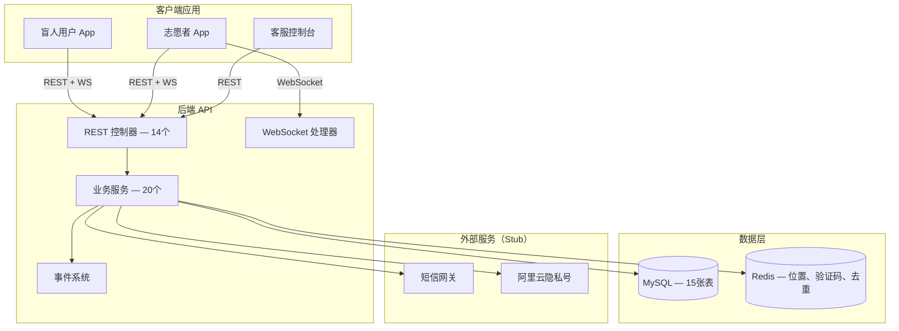
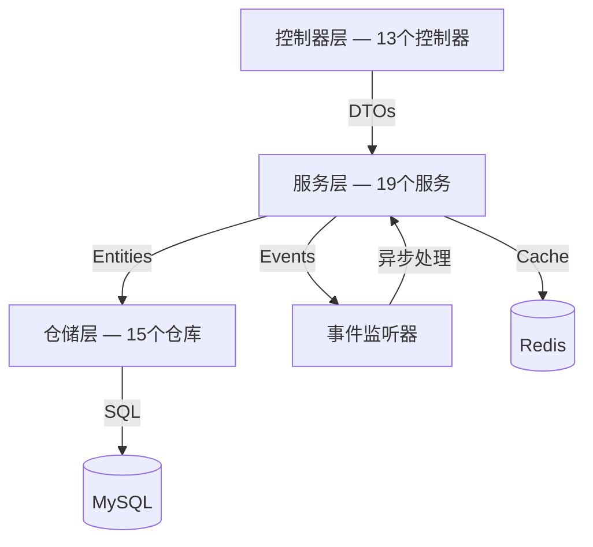
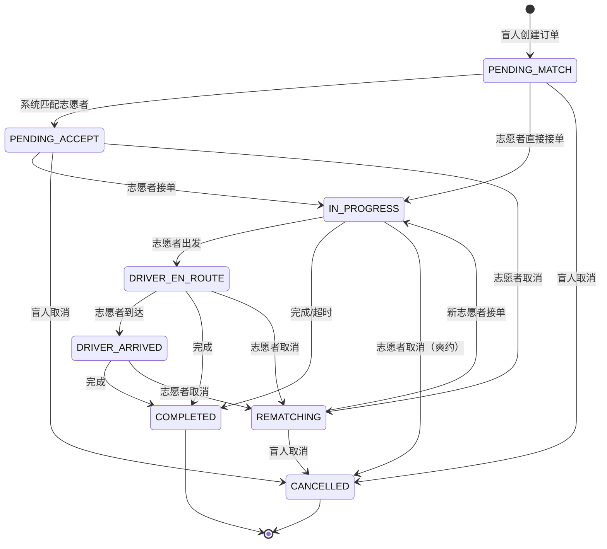
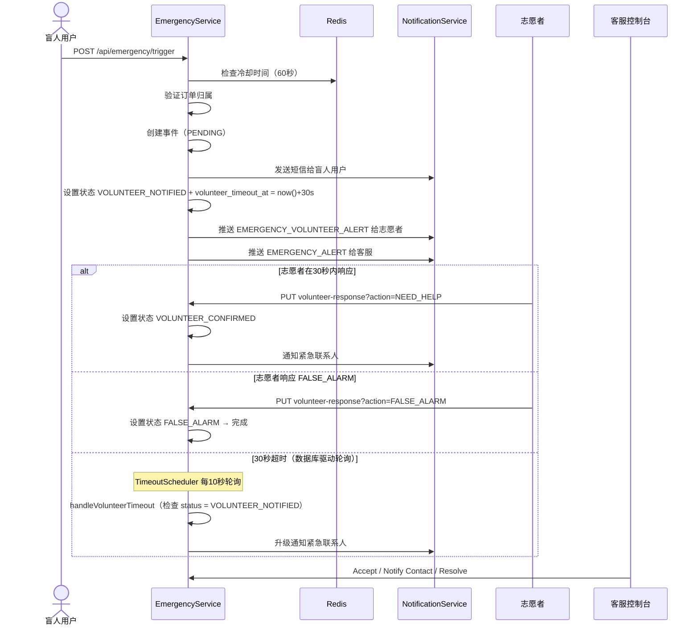
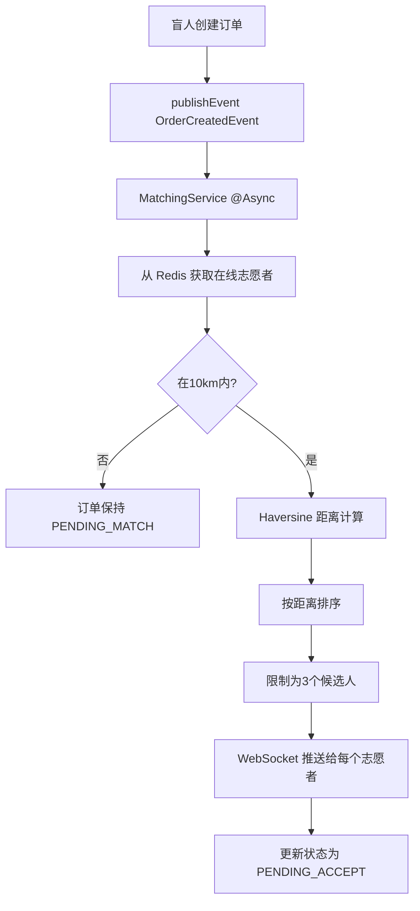
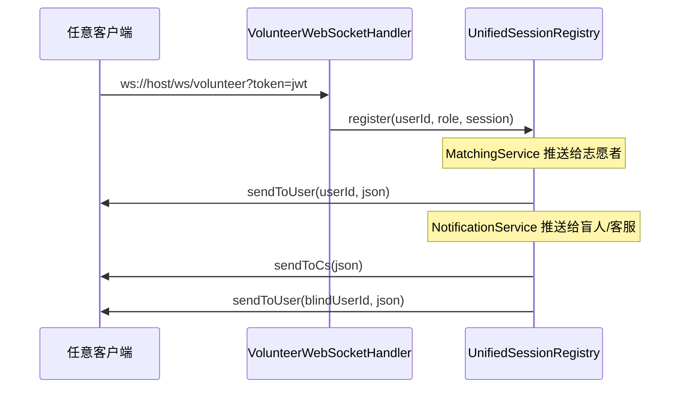

# 助盲跑后端系统 - 架构指南

## 概述

**助盲跑（Blind Running Companion）** 连接视障跑者与志愿者陪跑者。系统提供实时匹配、订单生命周期管理、紧急响应、接近检测和隐私号通话服务。

### 核心功能
- **短信验证码认证**: 手机号验证，限时验证码
- **实时匹配**: 基于地理位置的志愿者选择，使用 Redis 缓存
- **订单生命周期管理**: 状态机驱动的订单处理（7种状态）
- **紧急响应**: 志愿者确认流程，30秒超时，客服升级
- **接近检测**: 盲人用户与志愿者之间的实时距离提醒
- **WebSocket 通知**: 多角色实时推送（盲人 + 志愿者 + 客服）
- **紧急联系人**: 独立 CRUD，每用户1-5个，支持主联系人
- **隐私号通话**: Mock 实现，返回虚拟号码和 CONNECTED 状态
- **评价系统**: 服务后评分和反馈

### 技术栈
- **框架**: Spring Boot 3.4.4, Java 17
- **数据库**: MySQL + JPA/Hibernate ORM (ddl-auto=update)
- **缓存**: Redis（位置、验证码、接近去重）
- **认证**: JWT (JSON Web Tokens) + 自定义过滤器链
- **实时通信**: WebSocket（原生实现，UnifiedSessionRegistry）
- **构建工具**: Gradle
- **测试**: 110个测试（107个常规 + 3个慢速），Testcontainers for Redis

---

## 系统概览



---

## 架构分层



### 控制器层 (`controller/`)

| 控制器 | 路径 | 用途 |
|------------|------|---------|
| AuthController | `/api/auth/**` | 短信登录、JWT |
| RoleController | `/api/user/role` | 一次性角色选择 |
| BlindController | `/api/blind/**` | 盲人档案 |
| BlindLocationController | `/api/blind/location` | 盲人位置上报 |
| EmergencyContactController | `/api/users/{id}/emergency-contacts` | 紧急联系人 CRUD |
| VolunteerController | `/api/volunteer/**` | 档案、认证、位置 |
| OrderController | `/api/orders/**` | 订单 CRUD + 接单/拒单/完成/取消 |
| OrderStatusController | `/api/orders/{id}/en-route\|arrived\|status-logs` | 状态转换 + 日志 |
| EmergencyController | `/api/emergency/**` | 触发 + 志愿者响应 |
| CsController | `/api/cs/**` | 客服紧急操作 |
| CsAuthController | `/api/cs/auth/**` | 客服用户名密码登录 |
| CallController | `/api/orders/{id}/call/**` | 通话发起 + 记录 |
| ReviewController | `/api/orders/{id}/review` | 评价 |
| UserController | `/api/users/{id}` | 用户信息 + 软删除 |

### 服务层 (`service/`)

| 服务 | 用途 |
|---------|---------|
| AuthService | 认证流程 |
| CSAuthService | 客服登录（BCrypt + JWT with csRole） |
| UserService | 用户管理、软删除 |
| BlindService | 盲人档案 CRUD |
| BlindLocationService | 盲人位置 Redis 缓存 |
| EmergencyContactService | 紧急联系人 CRUD（每用户1-5个） |
| VolunteerService | 志愿者档案 + 认证 |
| VolunteerLocationService | Redis+MySQL 双写位置 |
| OrderService | 订单生命周期（8个构造参数） |
| OrderStatusLogService | 记录每次状态变更 |
| MatchingService | 基于地理位置的志愿者选择 |
| EmergencyService | 紧急触发 + 志愿者超时流程 |
| NotificationService | WebSocket 推送 + 短信 stub |
| ProximityService | 100米接近检测 |
| PrivateNumberService | Mock 实现（CONNECTED + 虚拟号码） |
| ReviewService | 评价管理 |
| SmsService / AliyunSmsServiceImpl | 短信接口 + 阿里云实现 |
| VerificationCodeService | 基于 Redis 的验证码生成 |
| FileStorageService / LocalFileStorageService | 文件上传 |

### 仓储层 (`repository/`) — 15个仓库

UserRepository, BlindProfileRepository, VolunteerProfileRepository, VolunteerLocationRepository, VolunteerAvailableTimeRepository, RunOrderRepository, OrderReviewRepository, OrderStatusLogRepository, EmergencyContactRepository, EmergencyEventRepository, EmergencyNotificationRepository, NotificationLogRepository, NotificationTemplateRepository, CallRecordRepository, CSUserRepository

---

## 数据模型

### 实体关系图

```mermaid
erDiagram
    User ||--o| BlindProfile : "1:1 @MapsId"
    User ||--o| VolunteerProfile : "1:1 @MapsId"
    User ||--o{ RunOrder : "creates (BLIND)"
    User ||--o{ RunOrder : "accepts (VOLUNTEER)"
    User ||--o{ VolunteerLocation : "reports"
    User ||--o{ VolunteerAvailableTime : "has"
    User ||--o{ OrderReview : "writes"
    User ||--o{ EmergencyContact : "has 1-5"
    RunOrder ||--o| OrderReview : "has"
    RunOrder ||--o{ OrderStatusLog : "logs"
    RunOrder ||--o{ EmergencyEvent : "triggers"
    RunOrder ||--o{ CallRecord : "initiates"
    EmergencyEvent ||--o{ EmergencyNotification : "sends"
    EmergencyContact ||--o{ EmergencyNotification : "receives"
    CSUser ||--o{ EmergencyEvent : "handles"

    User {
        Long id PK
        String phone UK
        UserRole role
        LocalDateTime deletedAt
        LocalDateTime createdAt
    }

    BlindProfile {
        Long userId PK_FK
        String name
        String runningPace
        String specialNeeds
    }

    VolunteerProfile {
        Long userId PK_FK
        String name
        Boolean verified
        VerificationStatus verificationStatus
        String verificationDocUrl
    }

    RunOrder {
        Long id PK
        Long blindUserId FK
        Long volunteerId FK
        Double startLatitude
        Double startLongitude
        String startAddress
        OrderStatus status
        CancelledBy cancelledBy
        Long version
    }

    EmergencyContact {
        Long id PK
        Long userId FK
        String name
        String phone
        String relationship
        Boolean isPrimary
    }

    EmergencyEvent {
        Long id PK
        Long orderId FK
        Long userId FK
        TriggerType triggerType
        EmergencyStatus status
        BigDecimal gpsLat
        BigDecimal gpsLng
        VolunteerAction volunteerAction
        Long csUserId FK
    }

    OrderStatusLog {
        Long id PK
        Long orderId FK
        String fromStatus
        String toStatus
        String remark
    }

    CallRecord {
        Long id PK
        Long orderId FK
        String callerRole
        String calleeRole
        CallStatus status
    }

    CSUser {
        Long id PK
        String username UK
        String department
        CSRole role
    }
```

---

## 订单生命周期

### 状态机



### 状态转换规则

| 从状态 | 到状态 | 触发条件 | 操作者 |
|------|----|---------|-----|
| PENDING_MATCH | PENDING_ACCEPT | 匹配成功 | 系统 |
| PENDING_MATCH | IN_PROGRESS | 直接接单 | 志愿者 |
| PENDING_MATCH | CANCELLED | 取消 | 盲人 |
| PENDING_ACCEPT | IN_PROGRESS | 接单 | 志愿者 |
| PENDING_ACCEPT | REMATCHING | 取消 | 志愿者 |
| IN_PROGRESS | DRIVER_EN_ROUTE | 出发 | 志愿者 |
| DRIVER_EN_ROUTE | DRIVER_ARRIVED | 到达 | 志愿者 |
| DRIVER_EN_ROUTE | REMATCHING | 取消 | 志愿者 |
| DRIVER_ARRIVED | REMATCHING | 取消 | 志愿者 |
| REMATCHING | IN_PROGRESS | 接单 | 新志愿者 |
| REMATCHING | CANCELLED | 取消 | 盲人 |
| IN_PROGRESS/EN_ROUTE/ARRIVED | COMPLETED | 完成 | 志愿者 |
| IN_PROGRESS | CANCELLED | 取消（爽约） | 志愿者 |

每次状态变更都会被 `OrderStatusLogService` 记录，并触发 `NotificationService.sendOrderStatusChange()`。

---

## 紧急响应系统

### 流程



### 关键设计决策
- **数据库驱动轮询** 通过 `TimeoutScheduler`（替代 ScheduledExecutorService）
- **数据库超时字段**（`volunteer_timeout_at`、`rematch_notify_at`、`match_notify_at`）替代 Redis 键
- **冷却时间** 通过 `emergency:cooldown:{userId}`（60秒，仍用 Redis）
- **CSUser** 在独立的 `cs_users` 表中（不在 `users` 表中）

---

## 实时匹配系统

### 匹配算法



### Redis 键

| 键模式 | TTL | 用途 |
|-------------|-----|---------|
| `vol:loc:{userId}` | 30秒 | 志愿者位置 |
| `blind:loc:{userId}` | 30秒 | 盲人用户位置 |
| `sms:code:{phone}` | 300秒 | 验证码 |
| `emergency:cooldown:{userId}` | 60秒 | 紧急触发冷却 |
| `proximity:notified:{orderId}` | — | 接近提醒去重 |

---

## WebSocket 通信

### 统一会话注册表

在单个注册表中支持盲人、志愿者和客服会话：



### 消息路由

| 方法 | 目标 | 用例 |
|--------|--------|----------|
| `sendToUser(userId, json)` | 特定用户 | 订单推送、紧急提醒 |
| `sendToCs(json)` | 所有客服会话 | 紧急升级 |
| `sendToUser(blindUserId, json)` | 盲人用户 | 状态变更、接近提醒 |

---

## 接近检测

### ProximityService

当盲人和志愿者位置都可用时，检查距离是否小于 `app.proximity.threshold-meters`（默认：100米）。使用 Redis `proximity:notified:{orderId}` 防止重复提醒。

**流程：**
1. 盲人上报位置 → `BlindLocationService` 更新 Redis `blind:loc:{userId}`
2. 对于进行中的订单，`ProximityService` 计算到志愿者的距离
3. 如果 < 100米 且尚未提醒 → WebSocket 推送给盲人和志愿者
4. 设置 Redis 去重键防止重复提醒

---

## 定时任务

### 订单超时自动完成

**调度器：** `OrderTimeoutScheduler.autoCompleteTimedOutOrders()`
**触发频率：** 每60秒
**用途：** 完成超过 `plannedEndTime` 的订单

### TimeoutScheduler（数据库驱动轮询）

所有超时检测使用数据库字段，而不是 Redis 键或 ScheduledExecutorService。

| 方法 | 间隔 | 条件 | 用途 |
|--------|----------|-----------|---------|
| `checkEmergencyTimeout` | 10秒 | `status=VOLUNTEER_NOTIFIED AND volunteer_timeout_at < NOW()` | 志愿者未响应时升级 |
| `checkRematchTimeout` | 10秒 | `status=REMATCHING AND rematch_notify_at < NOW()` | 提醒盲人用户，续期计时器 |
| `checkMatchTimeout` | 10秒 | `status=PENDING_MATCH AND match_notify_at < NOW()` | 提醒盲人用户"暂无志愿者" |
| `checkOverdueOrders` | 60秒 | `status=IN_PROGRESS AND planned_end_time < NOW()-1h AND overdue_notified=false` | 提醒志愿者超时订单 |

---

## 错误处理

### 异常层次

| 异常 | HTTP 状态 | 用例 |
|-----------|-------------|----------|
| `AuthException` | 400 | 验证码无效 |
| `OrderNotFoundException` | 404 | 订单不存在 |
| `OrderPermissionException` | 403 | 用户不匹配 |
| `DuplicateOrderException` | 409 | 存在进行中的订单 |
| `OrderStatusException` | 409 | 无效的状态转换 |
| `RoleAlreadySetException` | 409 | 角色已设置 |
| `OptimisticLockingFailureException` | 409 | 并发接单 |

### 响应格式

**旧格式**（认证）：`{ "error": "..." }`  
**标准格式**（订单等）：`{ "success": false, "code": 409, "message": "..." }`

---

## 安全模型

### JWT 认证

- Subject: userId (Long)
- CS token 额外携带 `csRole` 声明（`CS` 或 `ADMIN`）
- `JwtFilter` 将 csRole 存储在 `Authentication.details` 中；控制器检查此字段以限制仅客服可访问的端点
- 无服务器端会话（STATELESS）
- 禁用 CSRF（JWT 天然免疫）
- 自定义 `authenticationEntryPoint` 返回 401（而非 403）
- WebSocket 认证通过 `?token=` 查询参数

### SecurityConfig 公开端点
- `/api/auth/**` — 用户登录/注册
- `/api/cs/auth/**` — 客服登录
- `/ws/volunteer/**` — WebSocket 握手
- `/swagger-ui/**`、`/v3/api-docs/**` — API 文档

---

## 关键设计决策

| 决策 | 理由 |
|----------|-----------|
| `@MapsId` 用于档案 | 与 User 共享主键，高效 JOIN |
| `@Version` 在 RunOrder 上 | 防止并发接单（乐观锁） |
| 事件驱动匹配 | 非阻塞 UX，解耦服务 |
| Redis + MySQL 双写 | 快速匹配 + 持久化备份 |
| 原生 WebSocket（非 STOMP） | 更轻量，满足当前需求 |
| CSUser 独立表 | 不同的认证模型，字段隔离 |
| EmergencyContact 独立表 | 1-5个联系人 vs 单个嵌入联系人 |
| ScheduledExecutorService 用于紧急计时器 | 每事件计时器，非周期性 cron |
| DB 驱动轮询通过 TimeoutScheduler | 替代 ScheduledExecutorService + Redis 超时键；更简单、崩溃安全、重启时不丢失计时器 |
| SmsService 接口 + AliyunSmsServiceImpl | 阿里云号码认证服务实现 |

---

## 配置

| 配置项 | 默认值 | 说明 |
|----------|---------|-------------|
| `server.port` | 8081 | 服务器端口 |
| `app.matching.max-distance-km` | 10 | 匹配半径（公里） |
| `app.matching.max-candidates` | 3 | 每订单最大志愿者数 |
| `app.websocket.endpoint` | /ws/volunteer | WebSocket 路径 |
| `app.volunteer.location-ttl-seconds` | 30 | 位置 TTL（秒） |
| `app.proximity.threshold-meters` | 100 | 接近阈值（米） |
| `app.emergency.cooldown-seconds` | 60 | 紧急冷却时间（秒） |
| `app.emergency.volunteer-timeout-seconds` | 30 | 志愿者超时（秒） |
| `app.rematch.timeout-seconds` | 300 | 重新匹配提醒前超时（秒） |
| `app.match.timeout-seconds` | 300 | 匹配提醒前超时（秒） |
| `aliyun.private-number.enabled` | false | 隐私号功能开关 |
| `app.upload.dir` | /tmp/blindrun-uploads/ | 文件存储目录 |

---

**文档版本：** 4.0
**最后更新：** 2026-04-14
**框架：** Spring Boot 3.4.4 / Java 17
