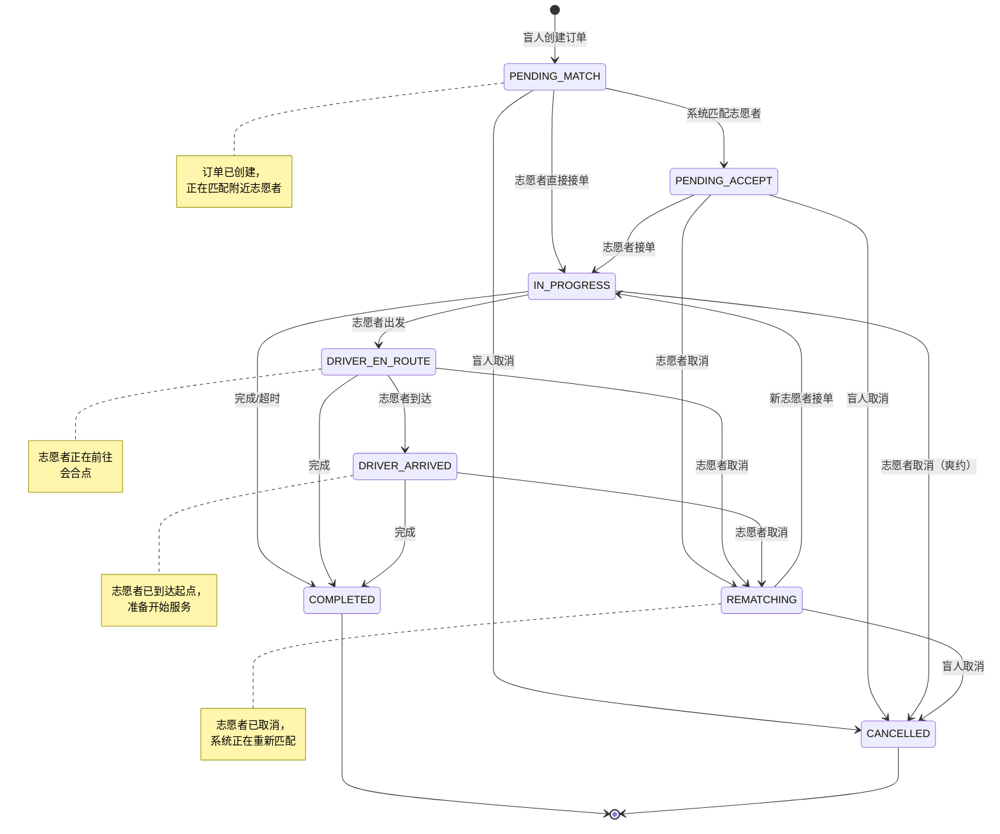
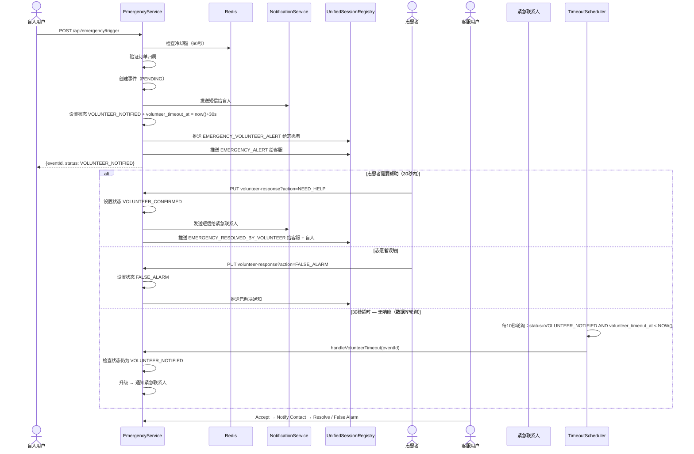
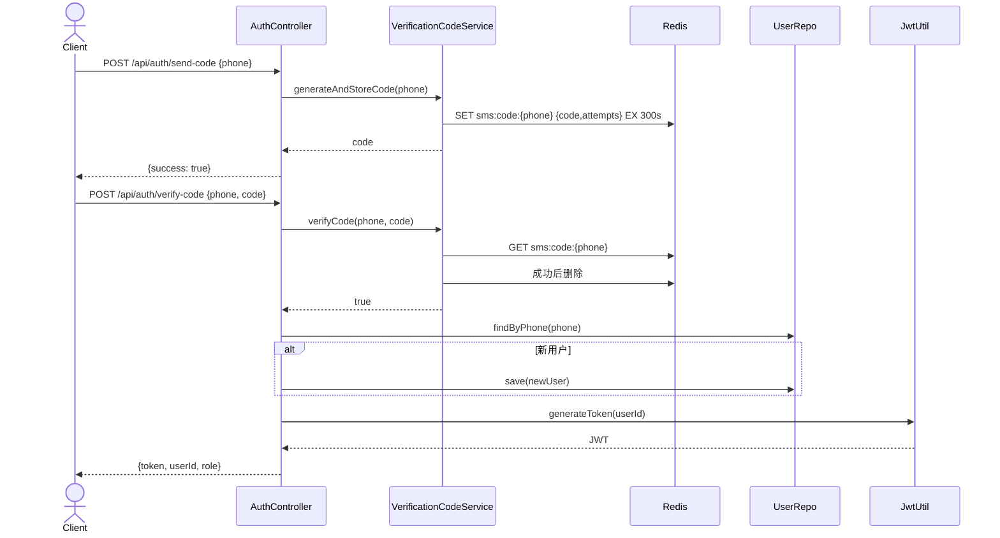
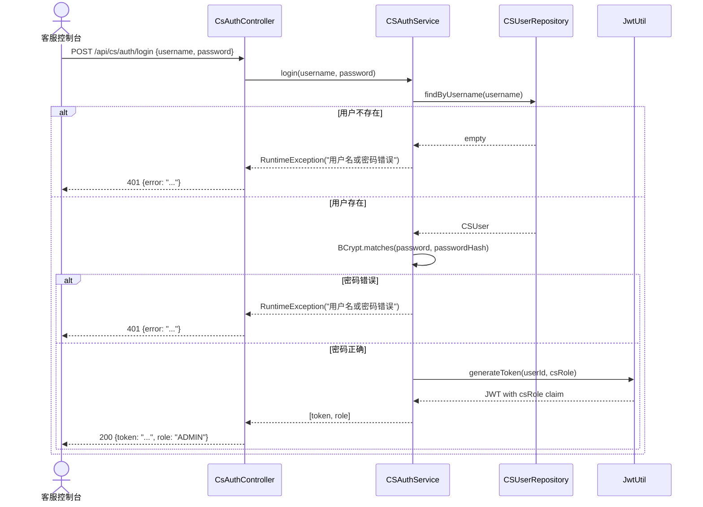
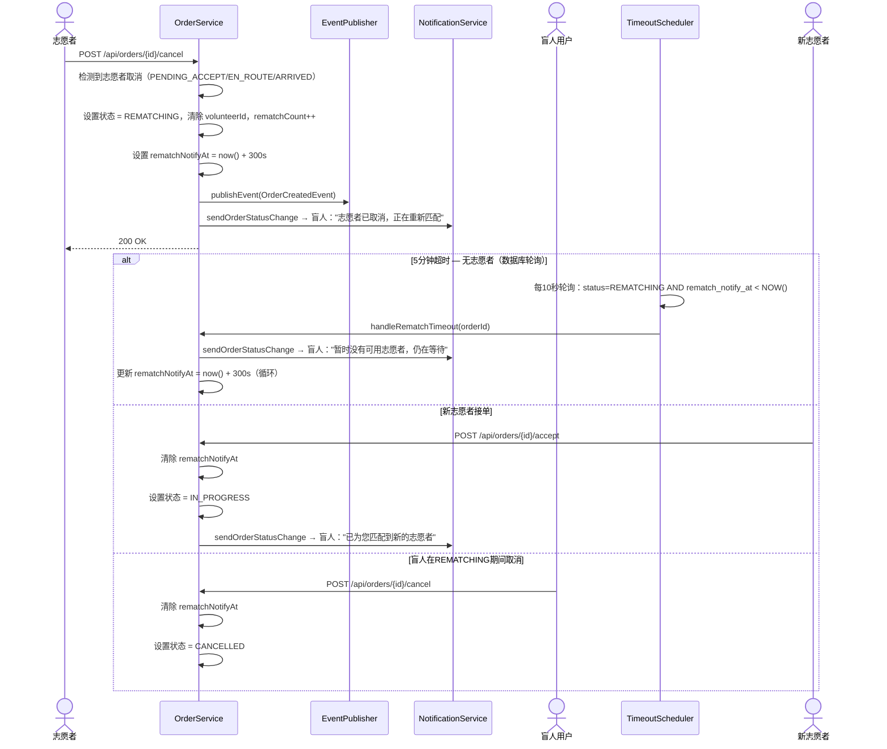
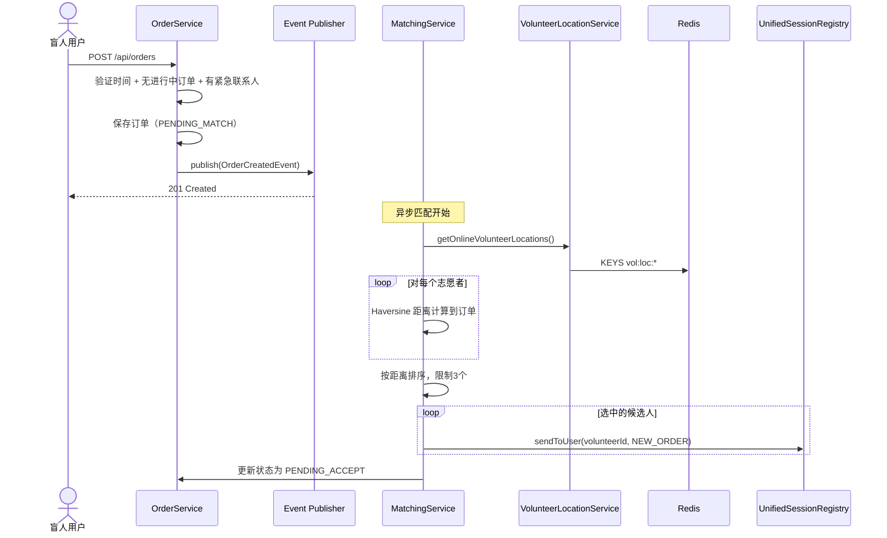
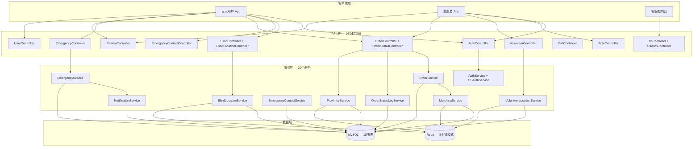
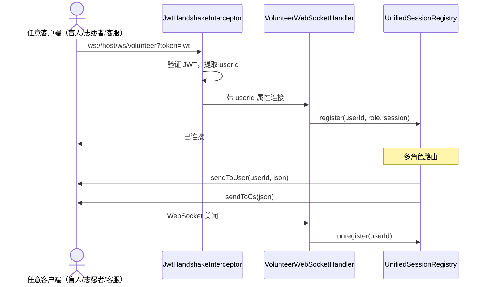
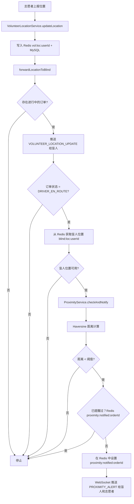

# 助盲跑 - Mermaid 图表

---

## 1. 实体关系图

```mermaid
erDiagram
    USER {
        long id PK
        string phone UK
        UserRole role
        LocalDateTime deleted_at
        LocalDateTime created_at
    }

    BLIND_PROFILE {
        long user_id PK FK
        string name
        string running_pace
        string special_needs
    }

    VOLUNTEER_PROFILE {
        long user_id PK FK
        string name
        boolean verified
        VerificationStatus verification_status
        string verification_doc_url
    }

    RUN_ORDER {
        long id PK
        long blind_user_id FK
        long volunteer_id FK
        double start_latitude
        double start_longitude
        string start_address
        OrderStatus status
        CancelledBy cancelled_by
        int rematch_count
        datetime match_notify_at
        datetime rematch_notify_at
        boolean overdue_notified
        Long version
    }

    VOLUNTEER_LOCATION {
        long id PK
        long volunteer_id FK
        double latitude
        double longitude
        boolean is_online
    }

    VOLUNTEER_AVAILABLE_TIME {
        long id PK
        long volunteer_id FK
        string day_of_week
        LocalTime start_time
        LocalTime end_time
    }

    ORDER_REVIEW {
        long id PK
        long order_id UK FK
        long reviewer_id FK
        long reviewee_id FK
        integer rating
        string comment
    }

    ORDER_STATUS_LOG {
        long id PK
        long order_id FK
        string from_status
        string to_status
        string remark
        LocalDateTime created_at
    }

    EMERGENCY_CONTACT {
        long id PK
        long user_id FK
        string name
        string phone
        string relationship
        boolean is_primary
    }

    EMERGENCY_EVENT {
        long id PK
        long order_id FK
        long user_id FK
        TriggerType trigger_type
        EmergencyStatus status
        BigDecimal gps_lat
        BigDecimal gps_lng
        VolunteerAction volunteer_action
        Long cs_user_id FK
    }

    EMERGENCY_NOTIFICATION {
        long id PK
        long event_id FK
        long contact_id FK
        NotifyType notify_type
        NotifyStatus status
        string content
    }

    CALL_RECORD {
        long id PK
        long order_id FK
        string caller_role
        string callee_role
        CallStatus status
    }

    CS_USER {
        long id PK
        string username UK
        string department
        CSRole role
    }

    NOTIFICATION_LOG {
        long id PK
        long order_id FK
        long user_id FK
        NotificationChannel channel
        NotifyStatus status
        string content
    }

    USER ||--o| BLIND_PROFILE : "1:1 @MapsId"
    USER ||--o| VOLUNTEER_PROFILE : "1:1 @MapsId"
    USER ||--o{ RUN_ORDER : "creates"
    USER ||--o{ RUN_ORDER : "accepts"
    USER ||--o{ VOLUNTEER_LOCATION : "reports"
    USER ||--o{ EMERGENCY_CONTACT : "has 1-5"
    RUN_ORDER ||--o| ORDER_REVIEW : "has"
    RUN_ORDER ||--o{ ORDER_STATUS_LOG : "logs"
    RUN_ORDER ||--o{ EMERGENCY_EVENT : "triggers"
    RUN_ORDER ||--o{ CALL_RECORD : "initiates"
    EMERGENCY_EVENT ||--o{ EMERGENCY_NOTIFICATION : "sends"
    EMERGENCY_CONTACT ||--o{ EMERGENCY_NOTIFICATION : "receives"
    CS_USER ||--o{ EMERGENCY_EVENT : "handles"
```

---

## 2. 订单状态机



---

## 3. 紧急事件流程



---

## 4. 认证流程



---

## 4b. 客服认证流程



---

## 4c. 重新匹配流程（志愿者取消）



---

## 5. 订单匹配流程



---

## 6. 系统架构概览



---

## 7. WebSocket 生命周期



---

## 8. 接近检测流程



---

## 关键设计模式

### 1. 事件驱动架构
- 订单创建 → `OrderCreatedEvent` → `@Async @EventListener` 在 MatchingService 中
- 解耦订单创建与匹配逻辑

### 2. 双写缓存
- 志愿者位置：Redis（TTL 30秒）+ MySQL
- 盲人位置：仅 Redis（TTL 30秒）
- 主存储：Redis 用于快速访问。备份：MySQL 用于持久化。

### 3. 乐观锁
- `RunOrder.@Version` 防止并发接单
- `OptimisticLockingFailureException` → 409 Conflict

### 4. 统一会话注册表
- 单个注册表用于盲人、志愿者和客服 WebSocket 会话
- 替代旧版按角色分离的会话注册表，统一为 `UnifiedSessionRegistry`

### 5. 数据库驱动轮询（TimeoutScheduler）
- 替代 `ScheduledExecutorService` 和 Redis 超时键
- 数据库字段（`volunteer_timeout_at`、`rematch_notify_at`、`match_notify_at`）作为超时标记
- 4个轮询方法：紧急超时（10秒）、重新匹配超时（10秒）、匹配超时（10秒）、超时订单（60秒）
- 崩溃安全：定时器在服务器重启后仍然有效（持久化在数据库中）

### 6. 去重/冷却键
- `emergency:cooldown:{userId}` — 触发速率限制（60秒）
- `proximity:notified:{orderId}` — 接近提醒去重

---

## 配置属性

```properties
# 匹配算法
app.matching.max-distance-km=10
app.matching.max-candidates=3

# WebSocket
app.websocket.endpoint=/ws/volunteer

# 位置 TTL
app.volunteer.location-ttl-seconds=30

# 接近检测
app.proximity.threshold-meters=100

# 紧急事件
app.emergency.cooldown-seconds=60
app.emergency.volunteer-timeout-seconds=30

# 重新匹配
app.rematch.timeout-seconds=300

# 匹配超时
app.match.timeout-seconds=300

# 隐私号
aliyun.private-number.enabled=false

# 文件上传
spring.servlet.multipart.max-file-size=10MB
app.upload.dir=/tmp/blindrun-uploads/
```
