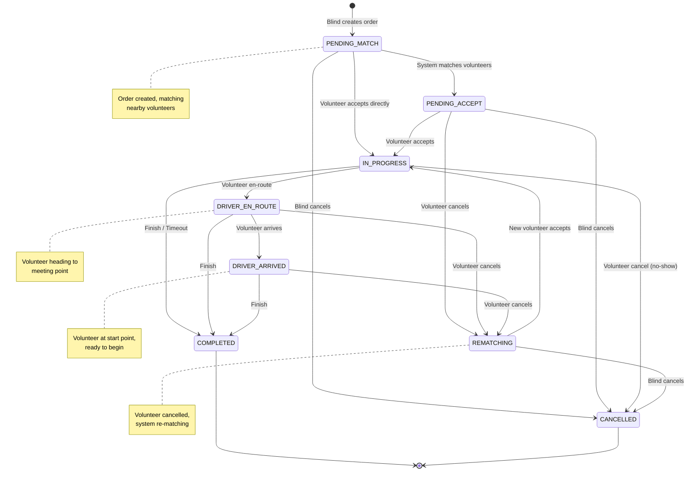
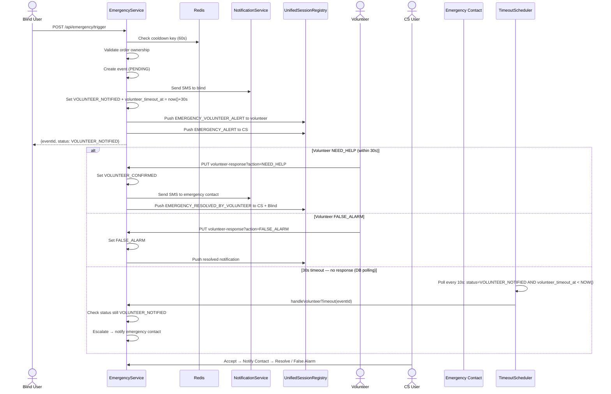
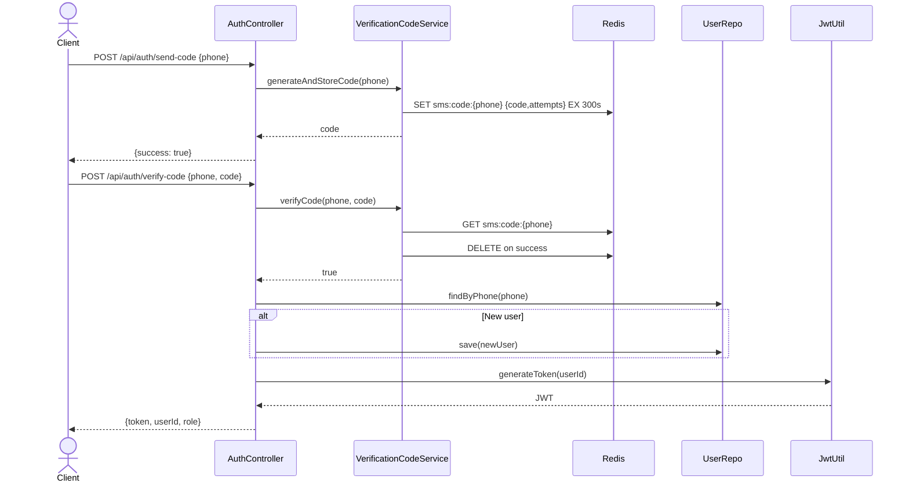
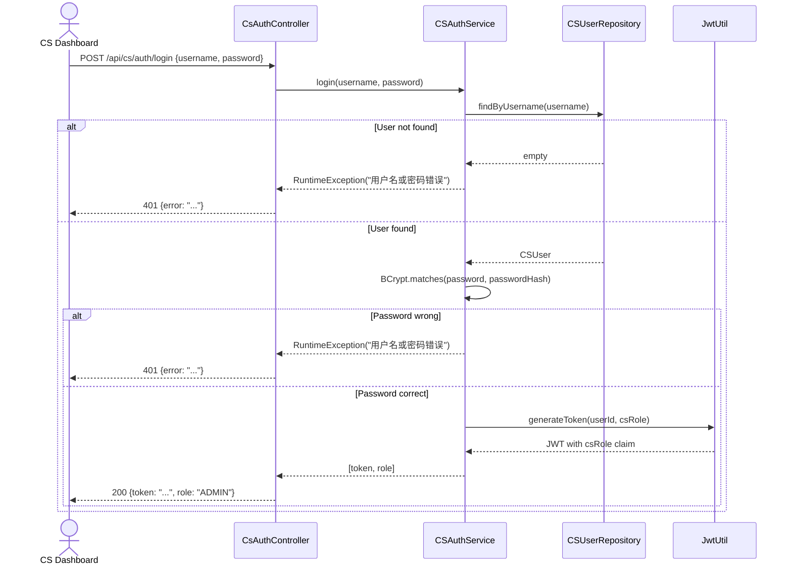
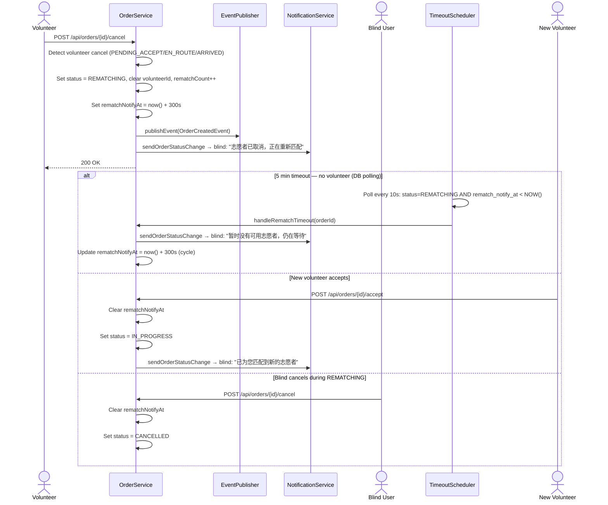
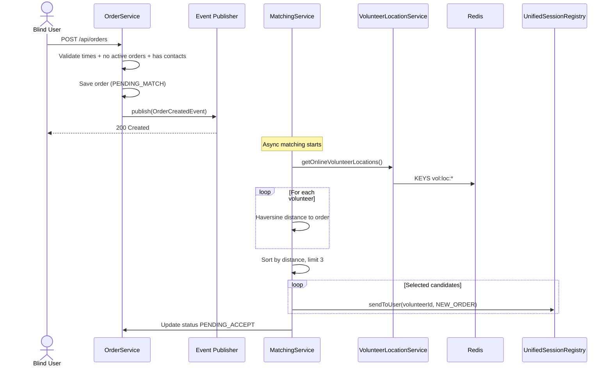
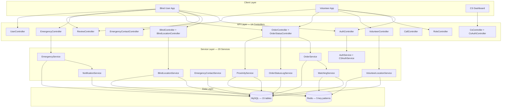
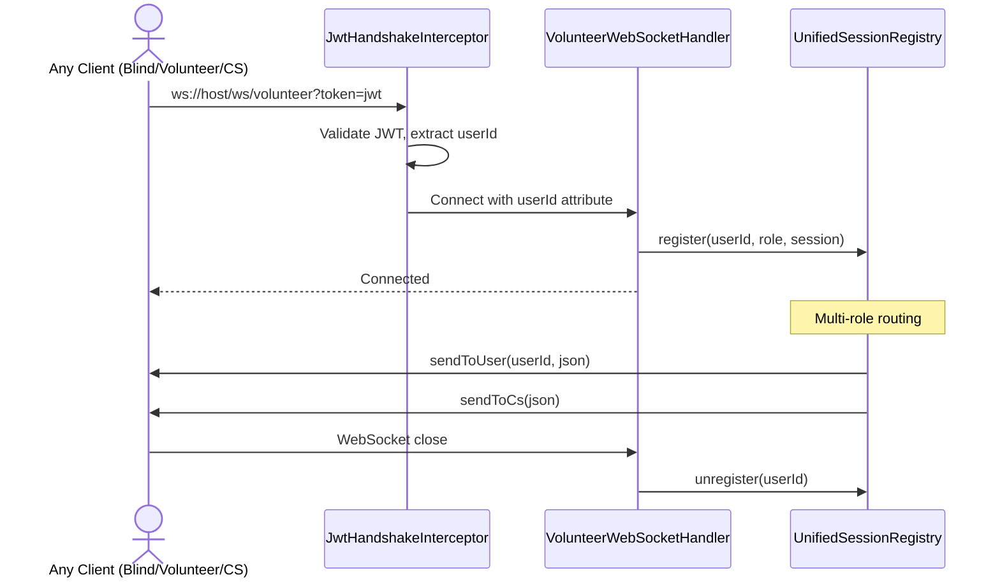
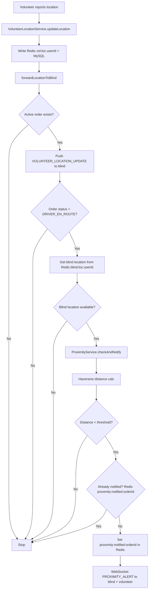

# Blind Running Companion (助盲跑) - Mermaid Diagrams

---

## 1. Entity Relationship Diagram

```mermaid
erDiagram
    USER {
        long id PK
        string phone UK
        UserRole role
        LocalDateTime deleted_at
        LocalDateTime created_at
    }

    BLIND_PROFILE {
        long user_id PK FK
        string name
        string running_pace
        string special_needs
    }

    VOLUNTEER_PROFILE {
        long user_id PK FK
        string name
        boolean verified
        VerificationStatus verification_status
        string verification_doc_url
    }

    RUN_ORDER {
        long id PK
        long blind_user_id FK
        long volunteer_id FK
        double start_latitude
        double start_longitude
        string start_address
        OrderStatus status
        CancelledBy cancelled_by
        int rematch_count
        datetime match_notify_at
        datetime rematch_notify_at
        boolean overdue_notified
        Long version
    }

    VOLUNTEER_LOCATION {
        long id PK
        long volunteer_id FK
        double latitude
        double longitude
        boolean is_online
    }

    VOLUNTEER_AVAILABLE_TIME {
        long id PK
        long volunteer_id FK
        string day_of_week
        LocalTime start_time
        LocalTime end_time
    }

    ORDER_REVIEW {
        long id PK
        long order_id UK FK
        long reviewer_id FK
        long reviewee_id FK
        integer rating
        string comment
    }

    ORDER_STATUS_LOG {
        long id PK
        long order_id FK
        string from_status
        string to_status
        string remark
        LocalDateTime created_at
    }

    EMERGENCY_CONTACT {
        long id PK
        long user_id FK
        string name
        string phone
        string relationship
        boolean is_primary
    }

    EMERGENCY_EVENT {
        long id PK
        long order_id FK
        long user_id FK
        TriggerType trigger_type
        EmergencyStatus status
        BigDecimal gps_lat
        BigDecimal gps_lng
        VolunteerAction volunteer_action
        Long cs_user_id FK
    }

    EMERGENCY_NOTIFICATION {
        long id PK
        long event_id FK
        long contact_id FK
        NotifyType notify_type
        NotifyStatus status
        string content
    }

    CALL_RECORD {
        long id PK
        long order_id FK
        string caller_role
        string callee_role
        CallStatus status
    }

    CS_USER {
        long id PK
        string username UK
        string department
        CSRole role
    }

    NOTIFICATION_LOG {
        long id PK
        long order_id FK
        long user_id FK
        NotificationChannel channel
        NotifyStatus status
        string content
    }

    USER ||--o| BLIND_PROFILE : "1:1 @MapsId"
    USER ||--o| VOLUNTEER_PROFILE : "1:1 @MapsId"
    USER ||--o{ RUN_ORDER : "creates"
    USER ||--o{ RUN_ORDER : "accepts"
    USER ||--o{ VOLUNTEER_LOCATION : "reports"
    USER ||--o{ EMERGENCY_CONTACT : "has 1-5"
    RUN_ORDER ||--o| ORDER_REVIEW : "has"
    RUN_ORDER ||--o{ ORDER_STATUS_LOG : "logs"
    RUN_ORDER ||--o{ EMERGENCY_EVENT : "triggers"
    RUN_ORDER ||--o{ CALL_RECORD : "initiates"
    EMERGENCY_EVENT ||--o{ EMERGENCY_NOTIFICATION : "sends"
    EMERGENCY_CONTACT ||--o{ EMERGENCY_NOTIFICATION : "receives"
    CS_USER ||--o{ EMERGENCY_EVENT : "handles"
```

---

## 2. Order State Machine



---

## 3. Emergency Event Flow



---

## 4. Authentication Flow



---

## 4b. CS Authentication Flow



---

## 4c. Rematch Flow (Volunteer Cancel)



---

## 5. Order Matching Flow



---

## 6. System Architecture Overview



---

## 7. WebSocket Lifecycle



---

## 8. Proximity Detection Flow



---

## Key Design Patterns

### 1. Event-Driven Architecture
- Order creation → `OrderCreatedEvent` → `@Async @EventListener` in MatchingService
- Decouples order creation from matching logic

### 2. Dual-Write Caching
- Volunteer locations: Redis (TTL 30s) + MySQL
- Blind locations: Redis (TTL 30s) only
- Primary: Redis for speed. Fallback: MySQL for persistence.

### 3. Optimistic Locking
- `RunOrder.@Version` prevents concurrent accept
- `OptimisticLockingFailureException` → 409 Conflict

### 4. Unified Session Registry
- Single registry for blind, volunteer, and CS WebSocket sessions
- Replaces per-role `VolunteerSessionRegistry`

### 5. DB-Driven Polling (TimeoutScheduler)
- Replaces `ScheduledExecutorService` and Redis timeout keys
- DB fields (`volunteer_timeout_at`, `rematch_notify_at`, `match_notify_at`) as timeout markers
- 4 polling methods: emergency timeout (10s), rematch timeout (10s), match timeout (10s), overdue orders (60s)
- Crash-safe: timers survive server restart (persisted in DB)

### 6. Dedup / Cooldown Keys
- `emergency:cooldown:{userId}` — trigger rate limit (60s)
- `proximity:notified:{orderId}` — proximity alert dedup

---

## Configuration Properties

```properties
# Matching
app.matching.max-distance-km=10
app.matching.max-candidates=3

# WebSocket
app.websocket.endpoint=/ws/volunteer

# Location TTL
app.volunteer.location-ttl-seconds=30

# Proximity
app.proximity.threshold-meters=100

# Emergency
app.emergency.cooldown-seconds=60
app.emergency.volunteer-timeout-seconds=30

# Rematch
app.rematch.timeout-seconds=300

# Match timeout
app.match.timeout-seconds=300

# Privacy Number
aliyun.private-number.enabled=false

# File Upload
spring.servlet.multipart.max-file-size=10MB
app.upload.dir=/tmp/blindrun-uploads/
```
